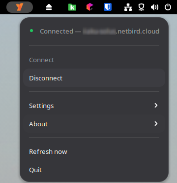
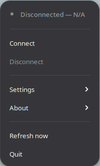
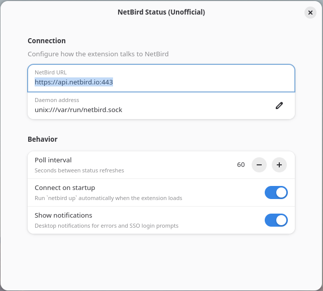

<p align="center">
  
</p>

<h1 align="center">NetBird Status</h1>

<p align="center">
  Unofficial GNOME Shell panel indicator for <a href="https://netbird.io">NetBird</a>.<br>
  Not affiliated with NetBird GmbH.
</p>

<p align="center">
  <a href="https://github.com/iiAku/gnome-shell-extension-netbird/actions/workflows/ci.yml"></a>
  
  <a href="LICENSE"></a>
</p>

---

A lightweight panel indicator that lets you monitor and control your NetBird VPN connection directly from the GNOME Shell top bar.

<p align="center">
  
  &nbsp;&nbsp;
  
  &nbsp;&nbsp;
  
</p>

## Features

- Bird icon in the top panel with color-coded connection state
- One-click connect and disconnect
- Automatic browser SSO — detects the login URL from `netbird up` and opens it
- Self-hosted support — works with custom management URLs (Zitadel, Keycloak, etc.)
- Feature flags toggled live — Allow SSH, Rosenpass, Lazy Connections, Block Inbound reconnect transparently without manual cycling
- Instant status detection via sysfs inotify on WireGuard interface changes
- Error reports copied to clipboard with full context (versions, OS, session type, stack trace) for easy GitHub issue filing
- Debug bundle generation from the menu
- Written in TypeScript, bundled with Bun, zero runtime dependencies

## Requirements

- GNOME Shell 46 or newer
- `netbird` CLI installed and the daemon running (`systemctl status netbird`)
- Your user must be able to run `netbird status` without `sudo` (NetBird daemon socket permissions)

## Install

### From extensions.gnome.org

Install directly from the [GNOME Extensions](https://extensions.gnome.org/) marketplace — search for **NetBird Status** or visit the extension page. This is the easiest method and handles updates automatically.

### From zip

Download the latest `.shell-extension.zip` from [Releases](https://github.com/iiAku/gnome-shell-extension-netbird/releases), then:

```bash
gnome-extensions install "netbird-status@iiaku.shell-extension.zip"
gnome-extensions enable netbird-status@iiaku
```

Log out and back in (Wayland) or press `Alt+F2` > `r` > Enter (X11) to activate.

### From source

Requires [Bun](https://bun.sh), `glib-compile-schemas`, `jq`, and `zip`.

```bash
git clone https://github.com/iiAku/gnome-shell-extension-netbird.git
cd gnome-shell-extension-netbird
bun install
make install
make enable
```

Log out and back in (Wayland) or press `Alt+F2` > `r` > Enter (X11) to activate.

## Configuration

Click the bird icon > **Settings** for quick toggles, or open **Advanced Settings** for the full preferences window.

You can also run:

```bash
gnome-extensions prefs netbird-status@iiaku
```

| Setting | Default | Description |
|---|---|---|
| NetBird URL | `https://api.netbird.io:443` | Management and admin URL for `netbird up` |
| Daemon address | `unix:///var/run/netbird.sock` | Path to the NetBird daemon socket |
| Poll interval | `60s` | Background status refresh frequency (3-300s) |
| Connect on startup | Off | Automatically run `netbird up` when the extension loads |
| Allow SSH | Off | Pass `--allow-server-ssh` to `netbird up` |
| Quantum-Resistance | Off | Pass `--enable-rosenpass` (experimental) |
| Lazy Connections | Off | Pass `--enable-lazy-connection` (experimental) |
| Block Inbound | Off | Pass `--block-inbound` to `netbird up` |

Toggling any feature flag while connected triggers an automatic reconnect so the change takes effect immediately.

## Troubleshooting

### No icon in the panel

Run `make logs` while toggling the extension in Extension Manager. Most failures are missing imports or an uncompiled gschema:

```bash
make schemas && make install
```

### "netbird CLI not found"

Ensure the `netbird` binary is on your PATH and the daemon is running:

```bash
which netbird
systemctl status netbird
```

### Permission denied

Verify `netbird status` works as your user without `sudo`. If not, check socket permissions:

```bash
ls -l /var/run/netbird.sock
```

### SSO browser never opens

Run `netbird up` directly from a terminal. The extension parses the first `http://` or `https://` URL from stdout/stderr. If your identity provider embeds the URL differently, please [file an issue](https://github.com/iiAku/gnome-shell-extension-netbird/issues/new?template=bug_report.yml).

### Reporting errors

When an error occurs, the extension automatically copies a detailed error report to your clipboard. Paste it directly into a [GitHub issue](https://github.com/iiAku/gnome-shell-extension-netbird/issues/new?template=bug_report.yml) — it includes your extension version, daemon version, GNOME Shell version, OS, session type, and stack trace.

## Development

See [CONTRIBUTING.md](CONTRIBUTING.md) for the full development guide.

**Quick start:**

```bash
bun install        # install deps + register git hooks
bun run build      # bundle extension + prefs
bun test           # run unit tests
make install       # build + install to GNOME Shell
make logs          # tail extension logs
```

### Architecture

```
src/
  extension.ts              Entry point — enable/disable lifecycle
  prefs.ts                  Adw preferences window
  lib/
    indicator.ts            PanelMenu.Button, state machine, polling
    netbird-client.ts       Gio.Subprocess wrapper around the netbird CLI
    netbird-args.ts         Pure argv builder for netbird commands
    netbird-status-parser.ts   Parses `netbird status` text output
    netbird-version-parser.ts  Parses `netbird version` output
    netbird-errors.ts       Typed error hierarchy
    error-report.ts         GitHub-issue-ready error formatter
    netbird-state.ts        State enum (Connected, Disconnected, etc.)
    settings.ts             GSettings key constants
    constants.ts            CLI flags, timeouts, UI labels
```

## License

[MIT](LICENSE) — see the license file for details.

The NetBird bird mark is a trademark of NetBird GmbH. This project is not affiliated with or endorsed by NetBird GmbH.
